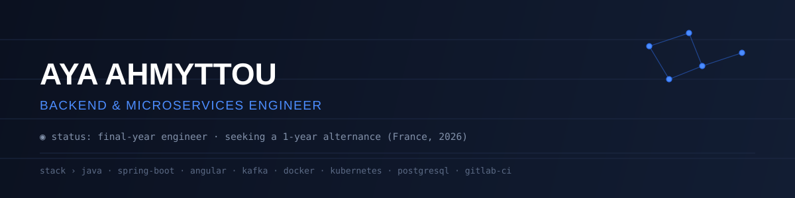
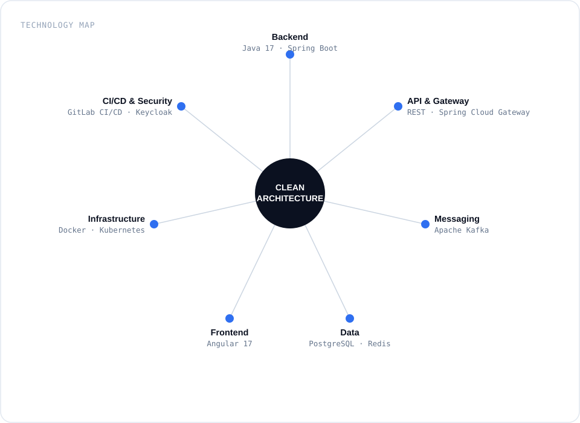

<div align="center">
  
</div>

<br>

Ingénieure logiciel en dernière année, orientée backend et architectures distribuées. Je conçois des systèmes en microservices — Spring Boot, Kafka, Angular, conteneurisés et sécurisés — en gardant Clean Architecture comme fil conducteur, pas comme mot-clé.

<br>

## Technology Map

<div align="center">
  
</div>

<br>

## Deployed Modules

| Module | Description | Stack |
|---|---|---|
| **[gestion_scolarite](https://github.com/ayaahmyttou/gestion_scolarite)** | Application de gestion scolaire — API métier et persistance | Java · Spring Boot · Maven |
| **[DrawY](https://github.com/ayaahmyttou/DrawY)** | Application de dessin par gestes de la main, pilotée à la voix, avec reconnaissance de texte manuscrit | Python · OpenCV · MediaPipe |
| **microservices-showcase** *(à venir)* | Démonstrateur d'architecture microservices : Spring Boot, Kafka, Angular, Docker | Java · Kafka · Angular · Docker |

<br>

## Experience

`PFE` — Conception d'une architecture microservices sécurisée pour digitaliser un processus métier, secteur ferroviaire (entreprise). Stack : Spring Boot · Kafka · Angular · Docker · Keycloak. *Détails sur demande / en entretien.*

<br>

## Now

```
◉ finishing   final-year PFE — secure microservices architecture
◉ building    a public microservices demo project
◉ open to     1-year alternance in France, starting 2026
```

<br>

## Contact

[LinkedIn](https://www.linkedin.com/in/aya-ahmyttou/) · [Email](mailto:aya.ahmyttou@gmail.com)

</div>
